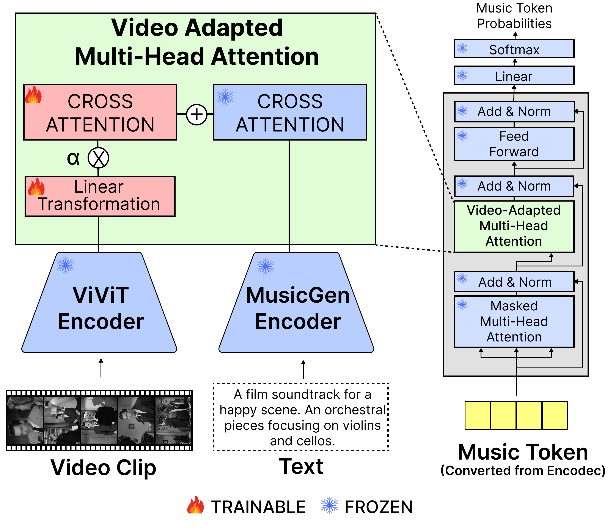

# Video-Guided Text-to-Music Generation Using Public Domain Movie Collections (ISMIR 2025)

This repository provides the Python implementations of our proposed model architecture, which integrates a video adapter into MusicGen, introduced in our paper titled "*Video-Guided Text-to-Music Generation Using Public Domain Movie Collections*" from ISMIR 2025. 



If you find this repository useful for your research, please consider citing our paper.

```
@InProceedings{ossl2025,
  itle={Video-Guided Text-to-Music Generation Using Public Domain Movie Collections},
  author={Kim, Haven and Novack, Zachary and Xu, Weihan and McAuley, Julian and Dong, Hao-Wen},
  journal={Proceedings of the 26th International Society for Music Information Retrieval (ISMIR)},
  year={2025}
}
```

### Acknowledgements

Our implementation builds heavily on the [official audiocraft repository](https://github.com/facebookresearch/audiocraft).

### Open Screen Sound Library Version 1 (OSSL-v1.)

Please see [this webpage](https://havenpersona.github.io/ossl_v1) for downloading the dataset.